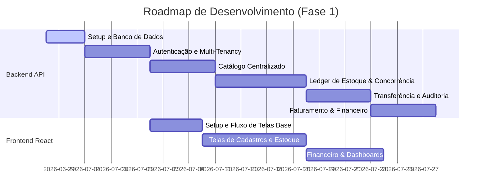

# Cronograma de Desenvolvimento: Estroque (Fase 1)

Este documento registra o planejamento técnico macro, as ondas de entrega e o progresso das tarefas concluídas e pendentes para a construção da Fase 1 da plataforma.

---

## 🛠️ Progresso Geral do Projeto

---

## 📋 Ondas de Desenvolvimento e Checklists

## 🛠️ Otimizações Técnicas & Refatorações (Concluído)
*Objetivo: Elevar a qualidade técnica, remover redundâncias arquiteturais e implementar a entrada de estoque físico automático por NF-e.*

- [x] **Centralização da Validação de CNPJ**: Criada a biblioteca `validation.py` no domínio e unificada em todas as entidades (`Tenant`, `Loja`, `Cliente` e `Fornecedor`), removendo acoplamentos indesejados.
- [x] **Limpeza Transacional**: Remoção do controle manual de transações em `transferencias.py` e `estoque_nfe.py`, delegando o controle transacional exclusivamente à dependência do FastAPI `get_db`.
- [x] **Entrada Física de Estoque na NF-e**: Atualizados o caso de uso e a rota de importação para, opcionalmente, realizar a entrada de saldos com lock pessimista e gravação no ledger de movimentações de estoque, validando isolamento (BOLA).
- [x] Suíte de Testes robustecida: Adicionado teste de integração completo de NF-e física, vendas e crediário, totalizando **115 testes executados com 100% de sucesso**.

---

### 🌌 Onda 1: Setup, Banco de Dados e Isolamento Multi-tenant
*Objetivo: Estabelecer o alicerce técnico e garantir a segurança lógica dos inquilinos (tenants) no banco de dados.*

* **Infraestrutura e Base**:
  - [x] Configuração de dependências (`requirements.txt`) compatíveis com Python 3.13.
  - [x] Configuração de variáveis de ambiente (`.env`) e ignorados (`.gitignore`).
  - [x] Criação do `docker-compose.yml` (PostgreSQL na porta `5433` para evitar conflito com serviço local, Redis).
  - [x] Estrutura inicial do FastAPI (`src/infrastructure/web/main.py`).
  - [x] Setup do SQLAlchemy e inicialização do Alembic.
  - [x] Criação e validação do banco de testes PostgreSQL (`gerenciador_saas_test`) no Docker.
  - [x] Implementação de testes de conectividade e health check com `pytest`.
  - [x] Criação de branch `chore/setup-inicial` e envio dos commits no padrão Conventional Commits.
* **Autenticação, JWT e Segurança** (Próximo Passo):
  * **Regras de Negócio e Domínio (Responsável: Jonathas)**:
    - [x] Criar entidades de domínio puras de `Tenant` e `Usuario` em Python puro ([src/domain/entities/](src/domain/entities/)).
    - [x] Definir exceções de negócio customizadas em [src/domain/exceptions/](src/domain/exceptions/).
    - [x] Criar interfaces e contratos abstratos dos repositórios em [src/domain/repositories/](src/domain/repositories/).
    - [x] Implementar os casos de uso purificados em Python: `CriarTenant` e `AutenticarUsuario` em [src/use_cases/autenticacao/](src/use_cases/autenticacao/).
  * **Persistência e Modelagem de Banco (Responsável: Leonardo)**:
    - [x] Mapear os modelos SQLAlchemy físicos de `tenants` e `usuarios` em [src/infrastructure/database/models.py](src/infrastructure/database/models.py) e gerar a migração Alembic.
    - [x] Implementar repositórios SQLAlchemy concretos e configurar o filtro de sessão global do `tenant_id` para isolamento.
  * **Segurança, Web e Testes (Responsável: Douglas)**:
    - [x] Desenvolver utilitários de segurança: hashing de senhas com `bcrypt` e manipulação de tokens JWT em [src/infrastructure/security/](src/infrastructure/security/).
    - [x] Desenvolver as rotas web do FastAPI (`/auth/register`, `/auth/login`) e a dependência de injeção `get_current_user` em [src/infrastructure/web/](src/infrastructure/web/).
    - [x] Implementar controle de taxa (Rate Limiting com SlowAPI e Redis) nos endpoints de autenticação e desenvolver testes de estresse DDoS correspondentes.
    - [x] Escrever a suíte de testes automatizados de integração e de simulação de vazamento multi-tenant (*SaaS leakage*) em [tests/](tests/).

---

### 📦 Onda 2: Catálogo Centralizado (Cadastros Base)
*Objetivo: Criar as tabelas e rotas necessárias para popular o banco de dados antes da movimentação de mercadorias.*

#### 👥 Divisão de Atividades por Responsável

##### 👤 Jonathas (Regras de Negócio e Domínio)
* **Atividades Independentes**:
  - [x] **[Urgência: Alta]** Criar entidade de domínio pura de `Loja` e contrato abstrato de seu repositório em [src/domain/](src/domain/).
  - [x] **[Urgência: Alta]** Criar entidade de domínio pura de `Produto` e contrato abstrato de seu repositório em [src/domain/](src/domain/).
  - [x] **[Urgência: Média]** Criar entidades de domínio puras (`Cliente`, `Fornecedor`) e contratos abstratos de seus repositórios em [src/domain/](src/domain/).
  - [x] **[Urgência: Média]** Implementar a regra de negócio do cálculo de precificação inteligente sugerida por **Markup** no domínio.
* **Atividades Dependentes**:
  - [x] **[Urgência: Alta]** Implementar os casos de uso purificados em Python para gerenciamento (CRUD) de Lojas (concluído).
  - [x] **[Urgência: Alta]** Implementar os casos de uso purificados em Python para gerenciamento (CRUD) de Produtos.
  - [x] **[Urgência: Média]** Implementar os casos de uso purificados em Python para gerenciamento de Clientes e Fornecedores.

##### 👤 Leonardo (Persistência, Web e Testes)
* **Atividades Independentes**:
  - [x] **[Urgência: Alta]** Desenvolver os schemas do Pydantic para validação de entrada/saída de Lojas em `src/infrastructure/web/schemas.py`.
  - [x] **[Urgência: Alta]** Desenvolver os schemas do Pydantic para validação de entrada/saída de Produtos em `src/infrastructure/web/schemas.py`.
  - [x] **[Urgência: Média]** Desenvolver os schemas do Pydantic para validação de entrada/saída de Clientes e Fornecedores.
* **Atividades Dependentes**:
  - [x] **[Urgência: Alta]** Mapear o modelo SQLAlchemy físico de `lojas` em `models.py`.
  - [x] **[Urgência: Alta]** Mapear o modelo SQLAlchemy físico de `produtos` em `models.py`.
  - [x] **[Urgência: Alta]** Gerar e aplicar a migração do Alembic para a tabela `lojas`.
  - [x] **[Urgência: Alta]** Gerar e aplicar a migração do Alembic para a tabela `produtos`.
  - [x] **[Urgência: Alta]** Implementar repositório SQLAlchemy concreto para Lojas.
  - [x] **[Urgência: Alta]** Implementar repositório SQLAlchemy concreto para Produtos.
  - [x] **[Urgência: Alta]** Desenvolver as rotas web do FastAPI de CRUD para Lojas.
  - [x] **[Urgência: Alta]** Desenvolver as rotas web do FastAPI de CRUD para Produtos.
  - [x] **[Urgência: Alta]** Escrever testes de schemas, repositórios e rotas de API para Lojas (com cobertura multi-tenant e isolamento).
  - [x] **[Urgência: Alta]** Escrever testes de schemas, repositórios e rotas de API para Produtos (com cobertura multi-tenant e isolamento).
  - [x] **[Urgência: Média]** Mapear os modelos SQLAlchemy físicos de `clientes` e `fornecedores`.
  - [x] **[Urgência: Média]** Gerar e aplicar a migração do Alembic para as tabelas `clientes` e `fornecedores`.
  - [x] **[Urgência: Média]** Implementar repositórios SQLAlchemy concretos para Clientes e Fornecedores (depende das interfaces abstratas de repositório criadas por Jonathas).
  - [x] **[Urgência: Média]** Desenvolver as rotas web do FastAPI de CRUD para Clientes e Fornecedores (depende dos repositórios de Leonardo e casos de uso de Jonathas).
  - [x] **[Urgência: Média]** Escrever testes de integração de API para Clientes/Fornecedores (depende das rotas FastAPI e inclui validação de limite de crédito).

---

### 🩸 Onda 3: O Coração do Estoque (Ledger & Concorrência)
*Objetivo: Construir a lógica de inventário blindada contra concorrência e falhas de quantidade física.*

#### 👥 Divisão de Atividades por Responsável (Frentes Verticais Independentes)

##### 👤 Leonardo (Frente 1: Ledger de Estoque & Controle de Concorrência - Fim a Fim)
*Objetivo: Construir do banco à API a infraestrutura do motor de saldos, movimentação e travas concorrentes de estoque de forma autônoma.*
* **Atividades**:
  - [x] **[Urgência: Alta]** Criar entidades de domínio puras (`EstoqueSaldo` e `EstoqueMovimentacao`) e contratos abstratos de seus repositórios em [src/domain/](src/domain/).
  - [x] **[Urgência: Alta]** Criar a exceção de negócio customizada `EstoqueInsuficienteException` em [src/domain/exceptions/business.py](src/domain/exceptions/business.py).
  - [x] **[Urgência: Alta]** Mapear os modelos SQLAlchemy físicos `EstoqueSaldoModel` e `EstoqueMovimentacaoModel` em `models.py`.
  - [x] **[Urgência: Alta]** Gerar e aplicar a migração do Alembic para a criação destas duas tabelas físicas no banco de dados.
  - [x] **[Urgência: Alta]** Implementar repositórios SQLAlchemy concretos para `EstoqueSaldo` e `EstoqueMovimentacao`, configurando a trava pessimista (`SELECT FOR UPDATE` via `.with_for_update()`).
  - [x] **[Urgência: Alta]** Implementar o caso de uso purificado `RegistrarMovimentacaoEstoque` (Entrada/Saída manual simples e validação de quantidade física).
  - [x] **[Urgência: Alta]** Desenvolver schemas Pydantic de entrada/saída para estoque em `src/infrastructure/web/schemas.py`.
  - [x] **[Urgência: Alta]** Desenvolver as rotas web do FastAPI de estoque (`POST /estoque/movimentar`, `GET /estoque/saldos` e `GET /estoque/movimentacoes`).
  - [x] **[Urgência: Alta]** Escrever suíte de testes de integração para o ledger de estoque, isolamento multi-tenant (*SaaS leakage*) e testes físicos de concorrência/condições de corrida (requisições simultâneas paralelas).

##### 👤 Jonathas (Frente 2: Importação de NF-e & Precificação Inteligente - Fim a Fim)
*Objetivo: Construir do banco à API o processador de XML de Nota Fiscal, auto-cadastro de fornecedores/produtos e custo médio ponderado.*
* **Atividades**:
  - [x] **[Urgência: Alta]** Adicionar os campos opcionais `codigo_barras` e `fornecedor_id` na entidade de domínio `Produto` em [src/domain/entities/produto.py](src/domain/entities/produto.py) e no modelo SQLAlchemy `ProdutoModel` em `models.py`.
  - [x] **[Urgência: Alta]** Gerar e aplicar a migração Alembic para adicionar as colunas `codigo_barras` e `fornecedor_id` na tabela de `produtos`.
  - [x] **[Urgência: Alta]** Implementar o parser em Python para ler e extrair os dados de emitente (Fornecedor) e itens (Produtos) do XML de NF-e.
  - [x] **[Urgência: Alta]** Implementar o caso de uso `ImportarEstoqueNFe` (recupera ou cria fornecedor, atualiza custo médio ponderado global do produto, recalcula preço de venda com base no markup e cadastra novos produtos ausentes).
  - [x] **[Urgência: Alta]** Desenvolver schemas Pydantic para recebimento do upload de arquivo XML em `src/infrastructure/web/schemas.py`.
  - [x] **[Urgência: Alta]** Desenvolver a rota web do FastAPI para upload e processamento do XML (`POST /estoque/importar-xml`).
  - [x] **[Urgência: Alta]** Escrever testes de integração para o parser de XML de NF-e, testes de cálculo de custo médio ponderado e testes de integração com a criação automática de entidades.

---

### 🚚 Onda 4: Transferências Logísticas e Auditoria Física
*Objetivo: Controlar o trânsito de produtos interlojas e gerenciar contagens rotativas.*

#### 👥 Divisão de Atividades por Responsável (Frentes Verticais Independentes)

##### 👤 Leonardo (Frente 1: Transferências Logísticas Interlojas - Fim a Fim)
*Objetivo: Construir do banco à API o fluxo completo de trânsito de mercadorias entre lojas com máquina de estados de forma isolada e segura.*
* **Atividades**:
  - [x] **[Urgência: Alta]** Criar a entidade de domínio `TransferenciaEstoque` com os estados (`SOLICITADO`, `DESPACHADO`, `RECEBIDO`, `DIVERGENTE`) e o contrato `TransferenciaEstoqueRepository` em `src/domain/`.
  - [x] **[Urgência: Alta]** Mapear o modelo SQLAlchemy `TransferenciaEstoqueModel` com restrições e relacionamentos físicos e gerar a migração Alembic correspondente.
  - [x] **[Urgência: Alta]** Implementar o repositório concreto `RepositorioTransferenciaEstoqueSQLAlchemy` respeitando multi-tenancy e integrando locks pessimistas.
  - [x] **[Urgência: Alta]** Desenvolver os Casos de Uso: `SolicitarTransferencia`, `DespacharTransferencia` (aplicando lock e debitando estoque de origem) e `ConfirmarRecebimento` (credita estoque de destino, valida divergências e insere justificativas).
  - [x] **[Urgência: Média]** Desenvolver os schemas Pydantic de request/response e as rotas web no FastAPI (`POST /estoque/transferencias`, `/despachar`, `/receber`).
  - [x] **[Urgência: Média]** Escrever testes de integração ponta a ponta da máquina de estados, testes de segurança multi-tenant e concorrência física nas travas de saldos de estoque.

##### 👤 Jonathas (Frente 2: Auditoria Física e Ajustes de Inventário - Fim a Fim)
*Objetivo: Construir do domínio à API o motor de contagem física de estoque e geração automática de perdas/ganhos no ledger.*
* **Atividades**:
  - [x] **[Urgência: Alta]** Criar entidade de domínio representativa de Auditoria/Inventário e regra de negócio para comparação de contagem física vs saldo lógico.
  - [x] **[Urgência: Alta]** Desenvolver o Caso de Uso `AuditarEstoqueLoja` que valida a lista de produtos, calcula perdas/ganhos e gera movimentações automáticas de `SAIDA` ou `ENTRADA` ajustando os saldos em `EstoqueSaldo`.
  - [x] **[Urgência: Média]** Desenvolver schemas Pydantic para envio da lista de contagens da filial e a rota correspondente FastAPI (`POST /estoque/auditar`).
  - [x] **[Urgência: Média]** Escrever testes unitários e de integração validando os cenários de conformidade física, divergências parciais negativas e excedentes.

---

### 💰 Onda 5: Faturamento Administrativo, Financeiro e CRM
*Objetivo: Permitir vendas na retaguarda e integrar com fluxo de caixa e contas a pagar/receber.*

#### 👥 Divisão de Atividades por Responsável (Frentes Verticais Independentes)

##### 👤 Leonardo (Frente 1: Venda Administrativa e Crediário - Fim a Fim)
*Objetivo: Construir o fluxo completo de registro de venda na retaguarda com múltiplos itens, descontos, formas de pagamento e limite de crediário por cliente.*
* **Atividades**:
  - [x] Criar as entidades de domínio `Venda` e `ItemVenda` com validação de status e regras de negócio.
  - [x] Mapear os modelos SQLAlchemy físicos de `vendas` e `itens_venda` e gerar a migração Alembic.
  - [x] Implementar os repositórios SQLAlchemy concretos para Venda.
  - [x] Desenvolver o Caso de Uso `RegistrarVendaAdministrativa` (valida estoque físico de cada item, aplica descontos, registra forma de pagamento e calcula o total).
  - [x] Implementar a regra de **Crediário**: verificar limite de crédito do cliente, bloquear venda se ultrapassado, e atualizar o `saldo_devedor_crediario` no cadastro do cliente caso a venda seja nesta modalidade.
  - [x] Desenvolver schemas Pydantic de entrada/saída e as rotas web no FastAPI (`POST /vendas`, `GET /vendas/{id}`).
  - [x] Escrever testes de integração e concorrência ponta a ponta (verificando débito do estoque físico, controle multi-tenant e verificação de limite de crediário).

##### 👤 Jonathas (Frente 2: Gestão Financeira e Despesas - Fim a Fim)
*Objetivo: Construir o motor financeiro com lançamentos automáticos de vendas (receitas), controle manual de despesas operacionais e integração com o fluxo de caixa.*
* **Atividades**:
  - [x] Criar a entidade de domínio `FinanceiroLancamento` (tipo receita/despesa, valor, categoria, status de pagamento) e seu contrato de repositório.
  - [x] Mapear o modelo SQLAlchemy físico `FinanceiroLancamentoModel` e gerar a migração Alembic correspondente.
  - [x] Implementar o repositório SQLAlchemy concreto para lançamentos financeiros.
  - [x] Desenvolver o Caso de Uso `RegistrarDespesaLoja` (controle manual de contas a pagar e despesas operacionais da filial).
  - [x] Implementar a **Integração de Caixa**: na finalização de uma venda (executada pela Frente 1), disparar automaticamente um lançamento do tipo `RECEITA` vinculado ao caixa da loja correspondente.
  - [x] Desenvolver schemas Pydantic e as rotas web no FastAPI (`POST /financeiro/despesas`, `GET /financeiro/lancamentos` com filtros de período e tipo).
  - [x] Escrever testes unitários e de integração de fluxo de caixa, verificando a criação automática de receitas e validação de despesas.

---

### 📊 Onda 6: Analytics, Relatórios e Celery Workers
*Objetivo: Gerar inteligência de negócio em tempo real e automatizar fechamentos por e-mail em segundo plano.*

##### Frente 1: Business Intelligence e Analytics (Faturamento & Estoque) -> **RESPONSÁVEL: Jonathas**
*Objetivo: Construir o motor analítico da aplicação para consolidação de KPIs financeiros e diagnósticos de estoque.*
* **Atividades**:
  - [x] **Consolidação de Margens**: Desenvolver a lógica de cálculo de Ticket Médio, Faturamento Bruto vs Custo de Mercadorias Vendidas (CMV) para gerar a margem de lucro real.
  - [x] **KPIs do Dashboard**: Criar o endpoint `GET /analytics/dashboard` retornando faturamento, ticket médio, quantidade de produtos em Estoque Crítico (abaixo do mínimo) e Rupturas (estoque zerado).
  - [x] **Algoritmo de Curva ABC**: Desenvolver o endpoint `GET /analytics/curva-abc` que calcula a representatividade acumulada de faturamento de cada produto e os classifica em classes A (80%), B (15%) e C (5%) baseando-se no Princípio de Pareto.
* **Status de Integração**: Onda 6 concluída e validada em conjunto (Frente 1 + Frente 2).

##### Frente 2: Processamento Assíncrono e Relatórios (Celery & Redis) -> **RESPONSÁVEL: Leonardo**
*Objetivo: Implementar a infraestrutura de background tasks para fechamentos automatizados de caixa e notificações.*
* **Atividades**:
  - [x] **Infraestrutura de Workers**: Configurar o Celery e o Redis no ambiente Docker do backend.
  - [x] **Template de E-mail**: Construir um template HTML moderno e responsivo para o relatório de fechamento diário do inquilino.
  - [x] **Scheduler (Celery Beat)**: Criar a rotina agendada que roda automaticamente toda noite compilando as receitas, despesas e vendas do dia de cada Tenant.
  - [x] **Envio SMTP**: Desenvolver a integração SMTP para disparo de e-mails para o proprietário (`DONO`) do tenant, com tratamento de filas e re-tentativas em caso de falha.
  - [x] **Testes Assíncronos**: Escrever testes para validar o comportamento dos workers do Celery e certificar que as tarefas consolidam os dados sem vazamentos.

---

### 🖥️ Onda 7: Frontend React (Interface SPA)
*Objetivo: Construir a interface do usuário responsiva e dinâmica.*

- [ ] Setup do React + Vite + Tailwind CSS.
- [ ] Estrutura de rotas protegidas por Roles do JWT (`ADMIN_SAAS`, `DONO`, `GERENTE`).
- [ ] Telas de Login e Configurações de Tenants.
- [ ] Telas de CRUDs (Produtos, Lojas, Funcionários, Clientes, Fornecedores).
- [ ] Painel de Estoque Multiloja e Tela de Transferências.
- [ ] Painel Financeiro e Dashboards analíticos com gráficos interativos.
